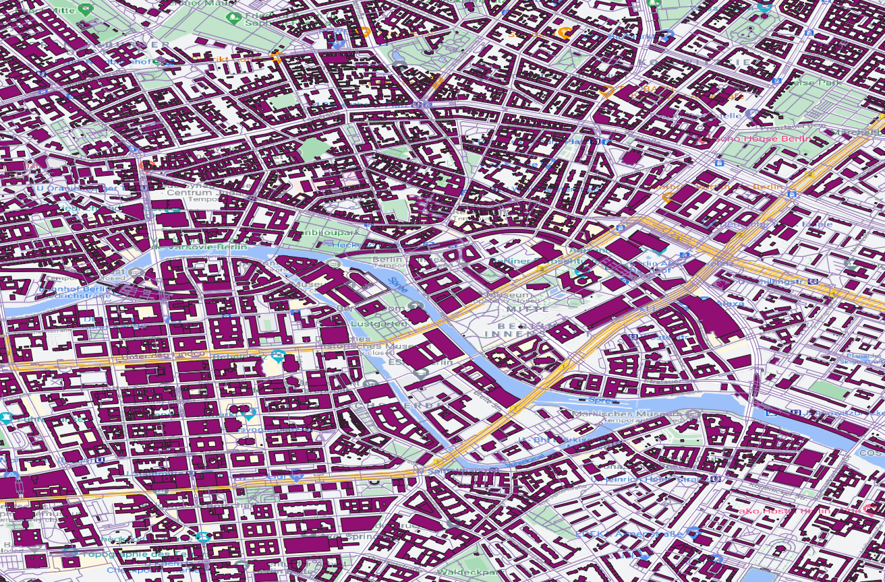
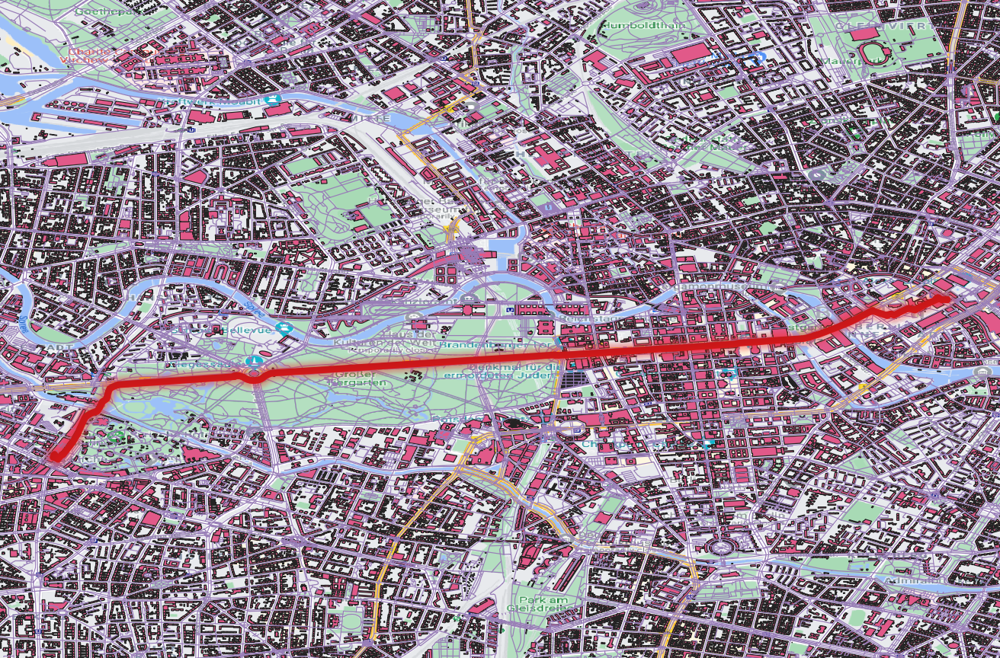
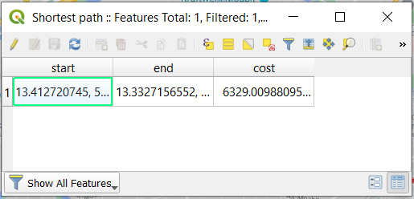

# QGIS-Network-Analysis - Berlin, Germany

## Find the shortest path (point to point) from OSM road shapefile
## Berlin Alexanderplatz to Berlin Zoologischer Garten

## Data source: Openstreetmap 
```
https://download.geofabrik.de/europe/germany.html
```

### Step 1: Download Berlin shapefile

### Step 2: QGIS: Layer -> Add layer -> Add Vector Layer... -> gis_osm_roads_free_1.dbf

### Step 3: Open XYZ Tiles: OpenStreetMap or Google Road to preliminary visual validation of the road shapefile

<!-- -->

### Step 4: Processing Toolbox -> Network Analysis

### Step 5: Shortest path (point to point):
```
Vector layer representing network:  OpenStreetMap Berlin road shapefile
Path type to calculate:             Shortest
Start point:                        Point to Alexanderplatz 
End point:                          Point to Zoologischer Garten
```

<!-- -->


### Step 6: Distance
```
Open Attribute Table: Cost (Distance in meters)
```

<!-- -->
